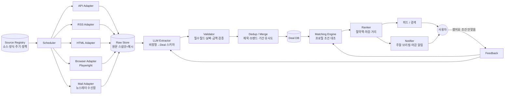
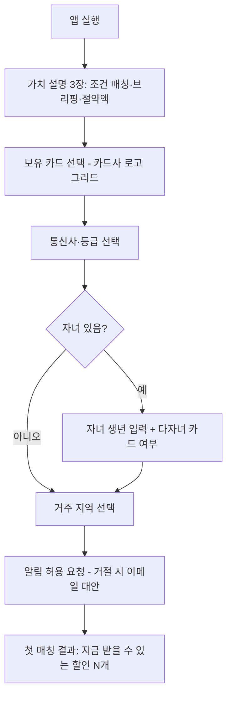
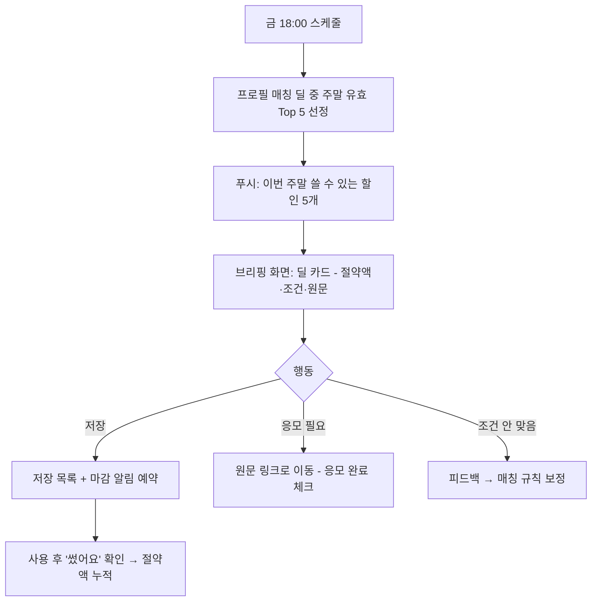
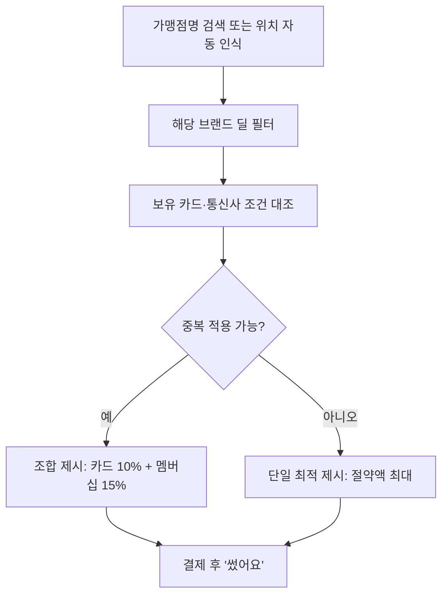
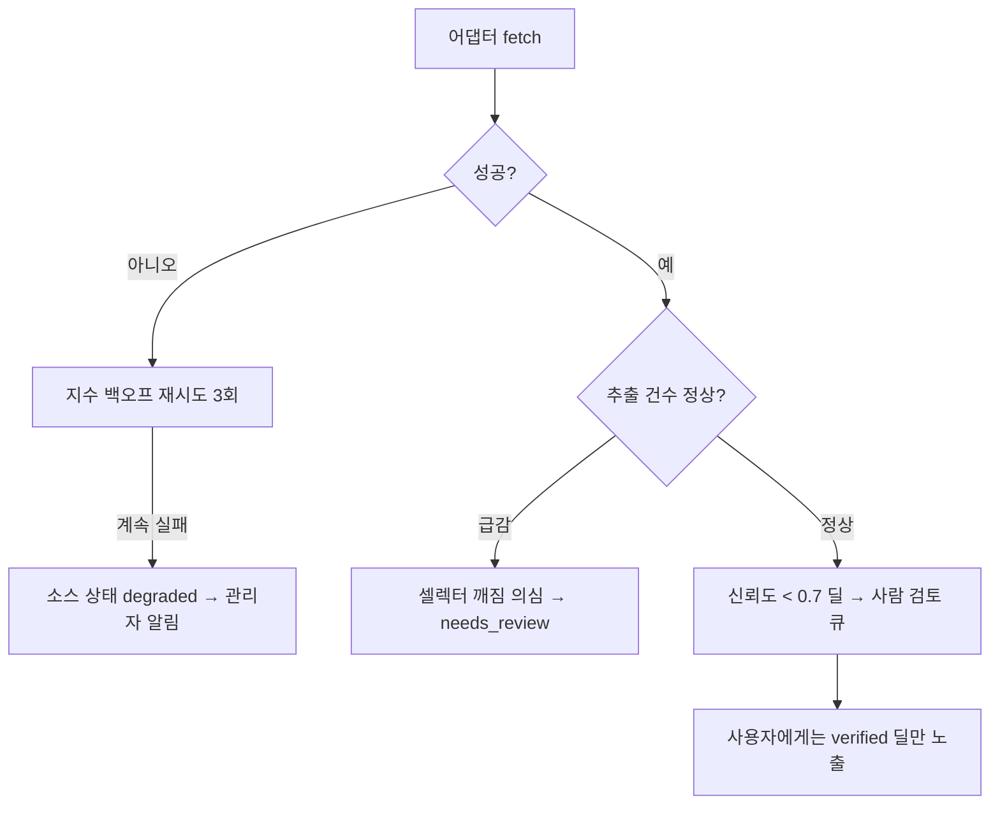

# 할인 레이더 (Discount Radar) 기획서 v0.1

> "외식·키즈카페·카드·여행… 흩어진 모든 할인 정보를 한 곳에서 싹싹 긁어와, **내 조건(보유 카드·통신사·자녀 나이·동네)에 맞는 것만** 골라 알려주는 플랫폼"
>
> 작성일 2026-09-06 · 상태 Draft · 산출 스킬: `medical-companion-app-planner` 4단계 구조 적용(규제 항목 제외) + 수집 파이프라인 설계 추가

---

## 0. 한 페이지 요약

| 항목 | 내용 |
|---|---|
| 문제 | 할인은 카드사 앱·통신사 멤버십·프랜차이즈 앱·지자체·핫딜 커뮤니티에 파편화되어 있고, 대부분 **쓸 수 있는데 몰라서** 놓친다 |
| 해결 | ① 소스 60여 개를 어댑터로 자동 수집 → ② LLM으로 공통 스키마 정규화 → ③ 내 프로필로 필터·랭킹 → ④ "지금·여기서·이 카드로" 알림 |
| 핵심 차별점 | 딜 나열이 아니라 **"내가 실제로 받을 수 있는 할인"만** 보여줌 (보유 카드·통신사·다자녀·지역화폐 조건 매칭) |
| MVP | 4개 도메인(외식·키즈카페·카드·여행) × 상위 20개 소스, 1인 가구용 개인 봇 → 앱 |
| North Star | 월간 **실제 절약액**(사용자가 "썼어요"로 확인한 할인 합계) |

---

## 1. 배경 및 문제 정의

### 1.1 왜 놓치는가 (파편화 지도)

```
카드사 앱(8개) ─┐
통신사 멤버십(3) ─┤
프랜차이즈 앱(수십) ─┤  → 사용자는 매번 결제 순간에 "이거 할인 되나?" 를 검색해야 함
지자체·정부(지역화폐, 다자녀, 문화의 날) ─┤   → 검색 비용 > 할인 금액 이면 포기
핫딜 커뮤니티(뽐뿌·클리앙·알구몬) ─┤
예약 플랫폼(캐치테이블·야놀자·놀이의발견) ─┘
```

### 1.2 사용자 문제 (가설)
- **P1 인지 실패**: 보유 카드에 이미 있는 할인을 모른다 (카드사 앱은 "이벤트 응모"가 필요한 것이 많아 더 놓침)
- **P2 타이밍 실패**: 알았어도 결제 순간에 떠올리지 못한다
- **P3 조건 불일치 피로**: 핫딜 사이트는 내 조건(카드 없음·지역 다름·자녀 나이 초과)에 안 맞는 딜이 90%
- **P4 유효기간 관리 실패**: 쿠폰·바우처를 받아놓고 만료시킨다

### 1.3 가설
"조건 매칭 + 결제 직전 알림"이 되면 4인 가족 기준 월 5~15만 원 절약이 가능하고, 이 절약액을 눈에 보이게 하면 주 3회 이상 재방문한다.

---

## 2. 타겟·페르소나·KPI

### 2.1 타겟 세그먼트

| 구분 | 세그먼트 | JTBD 한 줄 |
|---|---|---|
| Primary | 미취학~초등 자녀 둔 30~40대 맞벌이 가정 | "주말 외식·키즈카페·나들이 비용을 매번 검색 없이 줄이고 싶다" |
| Secondary | 카드 3장 이상 보유한 직장인 | "어느 카드로 결제해야 가장 이득인지 결제 순간에 알고 싶다" |
| Tertiary | 국내여행 자주 가는 가족 | "숙박·교통·입장권을 지자체 지원까지 합쳐서 최저가로 잡고 싶다" |

### 2.2 페르소나 카드

**① 지은 (38, 워킹맘, 자녀 7세·4세, 서울 강서구)**
- 보유: 신한·현대·삼성카드, SKT, 다둥이행복카드, 서울사랑상품권
- 동기: 주말마다 키즈카페 5만 원+외식 8만 원 → "이거 반은 줄일 수 있을 텐데"
- 좌절: 카드사 앱 이벤트 응모를 항상 결제 후에 발견함
- 성공 이미지: 토요일 아침 "오늘 갈 만한 곳 + 결제할 카드" 카드 1장이 와 있음
- 트리거: 금요일 저녁 주말 계획, 결제 직전

**② 민재 (34, 직장인 1인 가구, 카드 5장)**
- 동기: 통신사 멤버십·카드 할인을 100% 뽑아 쓰는 데서 성취감
- 좌절: 핫딜 커뮤니티 노이즈, 조건 확인에 시간 낭비
- 성공 이미지: 결제 전에 "이 가맹점은 B카드 10%·T멤버십 15% 중복 불가, B카드가 이득" 한 줄

**③ 수현 (42, 가족 여행 연 6회)**
- 동기: 숙박세일 페스타·지자체 관광 쿠폰·코레일 다자녀 할인을 조합
- 좌절: 지원 사업이 공고문 PDF에만 있어 검색이 안 됨

### 2.3 North Star Metric + KPI 트리

**NSM: 월간 확인된 절약액 (Confirmed Savings / MAU)**

| 계층 | KPI | 정의 (분자/분모) | 데이터 소스 | 목표(6개월) |
|---|---|---|---|---|
| Coverage | 소스 커버리지 | 정상 수집 중 소스 수 / 등록 소스 수 | 수집 로그 | ≥ 90% |
| Coverage | 신선도 | 24h 내 갱신된 딜 비율 | 딜 DB | ≥ 80% |
| Quality | 매칭 정확도 | 사용자가 "조건 안 맞음"으로 신고한 딜 / 노출 딜 | 피드백 이벤트 | ≤ 5% |
| Quality | 만료 딜 노출률 | 만료 후 노출된 딜 / 전체 노출 | 딜 DB + 노출 로그 | ≤ 1% |
| Engagement | 딜 저장률 | 저장 / 노출 | 앱 이벤트 | ≥ 8% |
| Engagement | 알림 → 열람률 | 알림 탭 / 알림 발송 | 푸시 로그 | ≥ 25% |
| Outcome | 확인된 절약액 | "썼어요" 확인 딜의 할인 금액 합 / MAU | 사용자 확인 | 월 5만 원 |
| Retention | W4 재방문 | 4주차 활성 / 신규 | 앱 이벤트 | ≥ 35% |
| Trust | 소스 링크 정확도 | 원문 링크 깨짐 신고 / 클릭 | 피드백 | ≤ 2% |

---

## 3. 수집 소스 맵 — "싹싹 긁어오기"의 실체

> 핵심 원칙: **소스마다 접근 방식이 다르다.** 공식 API → RSS → 정적 HTML → 동적 렌더링(브라우저) → 이메일/푸시 파싱 순으로 비용이 올라간다. 아래 표의 `방식` 컬럼이 어댑터 종류를 결정한다.

방식 범례: `API` 공식 API · `RSS` 피드 · `HTML` 정적 크롤링 · `BRW` 브라우저 렌더링(Playwright) · `MAIL` 뉴스레터 파싱 · `MAN` 수동/반자동 입력 · `LLM` 비정형 텍스트·PDF에서 LLM 추출

### 3.1 외식 (Dining)

| # | 소스 | 무엇을 긁는가 | 방식 | 우선순위 |
|---|---|---|---|---|
| D1 | 카드사 이벤트 페이지 (신한·삼성·현대·KB·롯데·우리·하나·NH) | 외식 카테고리 이벤트·응모형 할인·청구할인 | BRW+LLM | ★★★ |
| D2 | 통신사 멤버십 (T멤버십·KT멤버십·U+멤버십) | 제휴 외식 브랜드별 할인율·요일 조건 | BRW | ★★★ |
| D3 | 프랜차이즈 앱·공지 (스타벅스·맥도날드·버거킹·BBQ·교촌·빕스·아웃백 등) | 앱 전용 쿠폰·요일 프로모션 | HTML/BRW | ★★ |
| D4 | 배달앱 (배민·쿠팡이츠·요기요) 쿠폰 공지 | 카테고리 쿠폰·첫 주문·카드 제휴 | BRW | ★★ |
| D5 | 예약 플랫폼 (캐치테이블·테이블링·네이버 예약) | 예약 시 할인·타임세일 | BRW | ★★ |
| D6 | 지자체 착한가격업소·모범음식점 | 저가 업소 목록 | API(공공데이터포털) | ★ |
| D7 | 지역화폐·온누리상품권 (구매 할인율·특별 할인 기간) | 이달 할인율·한도·판매 재개 공지 | HTML+LLM | ★★★ |
| D8 | 핫딜 커뮤니티 (뽐뿌·클리앙 알뜰구매·루리웹 핫딜·알구몬·미스터핫딜) | 외식 쿠폰·기프티콘 딜 | RSS/HTML | ★★ |
| D9 | 기프티콘 거래 (기프티스타·니콘내콘·팔라고) | 브랜드별 시세(액면가 대비 할인율) | BRW | ★ |
| D10 | 페이 앱 (네이버페이·카카오페이·토스) 혜택 공지 | 결제 시 즉시할인·포인트백 | BRW | ★★ |

### 3.2 키즈카페·아동 놀이 (Kids)

| # | 소스 | 무엇을 긁는가 | 방식 | 우선순위 |
|---|---|---|---|---|
| K1 | 놀이의발견 / 네이버 예약 / 프립 | 키즈카페 타임할인·평일 특가 | BRW | ★★★ |
| K2 | 소셜커머스·티켓 (쿠팡·티몬·위메프·11번가 티켓) | 입장권 할인 상품 | BRW | ★★ |
| K3 | 다자녀·아동 복지 카드 (다둥이행복카드·아이조아카드·아이사랑카드·i-다자녀) 가맹점 | 지역별 가맹 키즈카페·할인율 | HTML/MAN | ★★★ |
| K4 | 지자체 육아 지원 (공동육아나눔터·장난감도서관·무료 실내놀이터) | 무료·저가 공공 놀이시설 | API/HTML+LLM | ★★ |
| K5 | 통신사 멤버십 키즈 카테고리 | 키즈카페·테마파크 제휴 | BRW | ★★ |
| K6 | 카드사 키즈·문화 카테고리 이벤트 | 키즈카페 결제 할인 | BRW+LLM | ★★ |
| K7 | 대형 키즈카페 브랜드 앱·SNS (챔피언·플레이타임·바운스 등) | 멤버십·생일 쿠폰 | HTML/MAN | ★ |
| K8 | 맘카페·지역 커뮤니티 (네이버 카페·당근 동네생활) | 동네 키즈카페 오픈 이벤트 | MAN(제보) | ★ |

### 3.3 카드 할인 (Card)

| # | 소스 | 무엇을 긁는가 | 방식 | 우선순위 |
|---|---|---|---|---|
| C1 | 카드사 8사 이벤트·혜택 페이지 | 진행 중 이벤트 전체 (응모 필요 여부 포함) | BRW+LLM | ★★★ |
| C2 | 카드 상품별 기본 혜택 (카드고릴라·카드사 상품 페이지) | 카드별 가맹점 할인 조건·전월 실적 | HTML+LLM | ★★★ |
| C3 | 카드사 앱 푸시·이메일 뉴스레터 | 개인화 타깃 이벤트 | MAIL | ★★ |
| C4 | 페이 앱 결제 프로모션 | 특정 카드 등록 시 즉시할인 | BRW | ★★ |
| C5 | 마이데이터(선택) | 보유 카드·실적 자동 인식 | API(마이데이터 사업자 제휴 필요) | ★ (Phase 3) |

### 3.4 여행 (Travel)

| # | 소스 | 무엇을 긁는가 | 방식 | 우선순위 |
|---|---|---|---|---|
| T1 | 항공사 특가 (대한항공·아시아나·LCC 6사) 프로모션 페이지·뉴스레터 | 타임세일·얼리버드 | HTML/MAIL | ★★★ |
| T2 | 숙박 (야놀자·여기어때·아고다·부킹닷컴·호텔스컴바인) 쿠폰 공지 | 쿠폰·카드 제휴 | BRW | ★★ |
| T3 | 정부·지자체 관광 지원 (숙박세일 페스타·지역 관광 쿠폰·근로자 휴가지원) | 공고·신청 기간 | HTML+LLM(PDF) | ★★★ |
| T4 | 교통 (코레일 다자녀·청소년·KTX 특가, SRT, 고속버스 조기예매) | 할인 유형·조건 | HTML | ★★ |
| T5 | 렌터카 (제주 렌터카 비교·소카·그린카) | 조기예약·카드 제휴 | BRW | ★ |
| T6 | 테마파크·관광지 (에버랜드·롯데월드·아쿠아리움) 통신사·카드 제휴 | 요일·멤버십 할인율 | BRW | ★★ |
| T7 | 한국관광공사 TourAPI | 축제·행사·무료 관광지 | API | ★★ |
| T8 | 문화가 있는 날(매월 마지막 수요일)·국립박물관 무료 | 정기 무료 일정 | MAN(규칙 기반) | ★ |

### 3.5 소스 접근 정책 (반드시 지킬 것)
- 각 소스의 `robots.txt`·이용약관을 어댑터 등록 시 확인하고 `Source Registry`에 기록 (`allowed / gray / blocked`)
- 로그인이 필요한 개인화 영역(카드사 앱 내 마이페이지)은 **사용자 본인 기기에서만** 처리하거나 이메일 전달 방식으로 대체. 서버가 사용자 계정으로 로그인하지 않는다
- 요청 빈도: 소스당 최소 30분 간격, 동시 요청 1, User-Agent 명시, 실패 시 지수 백오프
- 원문을 복제하지 않고 **요약 + 원문 링크**만 저장 (저작권·약관 리스크 축소)
- 개인정보(보유 카드·자녀 나이·주소)는 온디바이스 우선, 서버 저장 시 암호화·최소 수집

---

## 4. 핵심 기능 정의

### 4.1 기능 인벤토리

| ID | 카테고리 | 기능 | MoSCoW |
|---|---|---|---|
| F-01 | 수집 | 소스 레지스트리 + 어댑터 프레임워크 (API/RSS/HTML/BRW/MAIL/LLM) | Must |
| F-02 | 수집 | 스케줄러 (소스별 주기, 실패 감지, 헬스 대시보드) | Must |
| F-03 | 정규화 | LLM 기반 딜 추출 → 공통 스키마 (§5.2) | Must |
| F-04 | 정규화 | 중복 병합 (같은 딜이 여러 소스에 뜸) + 만료 자동 처리 | Must |
| F-05 | 프로필 | 내 조건 입력 (보유 카드·통신사·자녀 생년·거주 지역·자주 가는 브랜드) | Must |
| F-06 | 매칭 | 조건 매칭 엔진 (카드 보유·실적·지역·연령·요일·중복 불가 규칙) | Must |
| F-07 | 탐색 | 도메인별 피드 (외식/키즈/카드/여행) + 필터·정렬(절약액·마감임박) | Must |
| F-08 | 알림 | 주말 브리핑 (금요일 저녁 "이번 주말 쓸 수 있는 할인 Top 5") | Must |
| F-09 | 알림 | 마감 임박·응모 마감 알림 | Should |
| F-10 | 결제 보조 | "지금 이 가게, 어떤 카드?" 검색 (가맹점명 → 최적 카드·멤버십 조합) | Should |
| F-11 | 위치 | 근처 할인 (현재 위치 반경 1km, 다자녀 가맹점 포함) | Should |
| F-12 | 절약 기록 | "썼어요" 확인 → 월간 절약액 리포트 | Should |
| F-13 | 제보 | 사용자 제보 + 검증 큐 (맘카페·동네 이벤트 커버) | Could |
| F-14 | 가족 공유 | 배우자와 프로필·저장 딜 공유 | Could |
| F-15 | 마이데이터 | 보유 카드·실적 자동 연동 | Could (Phase 3) |
| F-16 | 캘린더 연동 | 저장한 딜을 에디의 하루 캘린더/구글 캘린더에 일정으로 넣기 | Could |
| — | — | 카드 발급 추천·광고형 큐레이션 (신뢰 훼손) | Won't |
| — | — | 서버가 사용자 카드사 계정으로 로그인 | Won't |

### 4.2 RICE 상위 기능

| 기능 | Reach | Impact | Confidence | Effort | RICE |
|---|---|---|---|---|---|
| F-06 조건 매칭 엔진 | 10 | 10 | 8 | 6 | 133 |
| F-01/03 수집+정규화 | 10 | 9 | 7 | 8 | 79 |
| F-08 주말 브리핑 | 9 | 8 | 9 | 3 | 216 |
| F-10 이 가게 어떤 카드 | 8 | 9 | 7 | 5 | 101 |
| F-12 절약 리포트 | 7 | 7 | 8 | 3 | 131 |

→ MVP = F-01~F-08. 브리핑(F-08)은 비용 대비 효과가 가장 커서 **Phase 0 개인 봇에서 먼저 검증**.

### 4.3 기능 카드 예시 — F-06 조건 매칭 엔진

- **한줄 설명**: 딜의 `conditions`와 사용자 프로필을 대조해 "받을 수 있음 / 조건부 / 불가"로 판정하고 예상 절약액을 계산
- **입력**: 딜(스키마 §5.2), 프로필(카드 목록·전월 실적 자가 입력·통신사 등급·자녀 생년월일·지역)
- **처리**: 규칙 엔진(카드 보유·실적·지역·연령·요일·시간) → 중복 적용 규칙(통신사+카드 중복 불가 등) → 절약액 = min(할인율×예상결제액, 한도)
- **출력**: 판정 라벨, 절약액, "왜 되는지" 근거 1줄, 원문 링크
- **예외**: 조건 파싱 실패 → "확인 필요" 라벨로 노출하되 랭킹 하향, 사용자 피드백으로 재학습
- **성공 측정**: 매칭 정확도 KPI, "조건 안 맞음" 신고율

---

## 5. 시스템 아키텍처 — 수집 파이프라인

### 5.1 파이프라인



### 5.2 공통 딜 스키마 (Deal)

```yaml
deal_id: uuid
source_id: "card.shinhan.events"     # Source Registry 키
source_url: "https://..."            # 원문 링크 (필수)
domain: dining | kids | card | travel | etc
title: "스타벅스 신한카드 20% 청구할인"
brand: ["스타벅스"]
merchant_match: { names: [...], categories: ["카페"] }
benefit:
  type: percent | amount | coupon | one_plus_one | free | point
  value: 20
  cap: 5000                          # 1회/월 한도
  unit: KRW
conditions:
  cards: [{ issuer: "신한", product: "any", min_spend_prev_month: 300000 }]
  telecom: null                      # { carrier: "SKT", grade: "VIP" }
  region: ["서울"]
  age: { child_max: 12 }             # 키즈
  weekday: [6, 0]                    # 토·일
  time: "10:00-14:00"
  requires_entry: true               # 응모 필요
  stackable_with: []                 # 중복 적용 가능 항목
  quantity_limit: "선착순 1,000명"
period: { start: "2026-09-01", end: "2026-09-30" }
confidence: 0.87                     # 추출 신뢰도
raw_hash: sha256                     # 변경 감지
extracted_at / verified_at
status: active | expired | needs_review
```

### 5.3 어댑터 인터페이스

```python
class SourceAdapter(Protocol):
    source_id: str
    schedule: str                 # cron
    policy: Literal["allowed", "gray", "blocked"]
    def fetch(self) -> list[RawDocument]: ...      # 원문 + 메타
    def extract(self, doc: RawDocument) -> list[Deal]: ...  # 규칙 or LLM
    def healthcheck(self) -> AdapterHealth: ...    # 셀렉터 깨짐 감지
```

- **셀렉터 깨짐 감지**: 추출 건수가 이동평균 대비 70% 이하로 떨어지면 `needs_review`로 자동 전환하고 관리자 알림
- **LLM 추출 프롬프트**: 원문 → Deal JSON. 필드 누락 시 `null` 강제, 날짜는 ISO, 금액은 정수. 신뢰도 0.7 미만은 사람이 검토
- **변경 감지**: `raw_hash` 동일하면 LLM 호출 생략 (비용 절감)

### 5.4 기술 스택 제안 (개인 → 서비스 단계별)

| 단계 | 수집 | 저장 | 추출 | 알림 | 클라이언트 |
|---|---|---|---|---|---|
| Phase 0 개인 봇 | Claude Code Routine(스케줄) + Playwright | Notion DB 또는 SQLite | Claude API | 텔레그램/카카오 나에게 보내기 | Notion 뷰 |
| Phase 1 베타 | Python 워커 + Playwright, n8n 스케줄 | Postgres + pgvector(유사도 중복 제거) | Claude API (batch) | FCM 푸시 + 이메일 | PWA (React) |
| Phase 2 서비스 | 큐(Redis/RQ) + 어댑터 워커 풀 | Postgres + 객체 스토리지(원문 스냅샷) | 배치 + 캐시 | 푸시 + 위치 기반 | 모바일 앱 |

---

## 6. 정보 구조(IA) & 유저 플로우

### 6.1 사이트맵 (4탭)

```
┌──────────┬──────────┬──────────┬──────────┐
│  오늘    │  탐색    │  내 카드  │  더보기  │
└──────────┴──────────┴──────────┴──────────┘
오늘   : 주말 브리핑 카드, 마감 임박, 근처 할인, 이번 달 절약액
탐색   : 외식 / 키즈 / 여행 / 전체 피드 + 필터(카드·통신사·지역·절약액)
내 카드: 보유 카드·통신사·다자녀 카드 등록, "이 가게 어떤 카드?" 검색
더보기 : 프로필(자녀·지역), 알림 설정, 저장한 딜, 제보, 데이터 삭제
```

### 6.2 핵심 플로우

**Flow 1 — 첫 사용 (프로필 설정)**


**Flow 2 — 주말 브리핑 (핵심 루프)**


**Flow 3 — 결제 직전 "이 가게 어떤 카드?"**


**Flow 4 — 수집 실패·데이터 이상 (시스템 플로우)**


**반드시 포함할 분기**
- 만료 딜은 노출 즉시 차단(만료 후 클릭 시 "종료됨" 표시 + 대안 제시)
- 응모형 이벤트는 "응모 필요" 배지 + 응모 마감 별도 알림
- 위치·알림 권한 거부 시 수동 지역 입력·이메일 브리핑으로 대체
- 원문 링크 깨짐 신고 → 해당 소스 헬스체크 즉시 실행

---

## 7. PRD 요구사항 (요약)

### 7.1 기능 요구사항

| ID | 요구사항 | 우선순위 | 검증 방법 |
|---|---|---|---|
| FR-001 | 시스템은 Source Registry에 등록된 소스를 지정 주기로 수집한다 | Must | 수집 로그 24h 커버리지 ≥ 90% |
| FR-002 | 원문에서 Deal 스키마 필수 필드(title, source_url, benefit, period)를 추출한다 | Must | 샘플 200건 수동 대조 정확도 ≥ 90% |
| FR-003 | 동일 딜을 소스 간 병합하고 원문 링크는 모두 보존한다 | Must | 중복 노출률 ≤ 3% |
| FR-004 | 만료된 딜은 피드·알림·검색에서 제외한다 | Must | 만료 딜 노출률 ≤ 1% |
| FR-005 | 사용자 프로필(카드·통신사·자녀·지역)로 딜을 "가능/조건부/불가"로 판정한다 | Must | 테스트 프로필 30개 × 딜 100건 판정 정확도 ≥ 90% |
| FR-006 | 매 딜에 예상 절약액과 판정 근거 1줄을 표시한다 | Must | UI 검수 |
| FR-007 | 금요일 저녁 주말 브리핑 푸시를 발송한다 (사용자 설정 시간 변경 가능) | Must | 발송 로그 |
| FR-008 | 가맹점명으로 최적 카드·멤버십 조합을 제시한다 | Should | 시나리오 테스트 |
| FR-009 | "썼어요" 확인 시 절약액을 누적하고 월간 리포트를 제공한다 | Should | 이벤트 로그 |
| FR-010 | 사용자는 딜에 대해 "조건 안 맞음·만료됨·링크 깨짐"을 신고할 수 있다 | Must | 피드백 큐 |
| FR-011 | 사용자는 프로필과 저장 데이터를 전체 삭제할 수 있다 | Must | 삭제 후 DB 조회 0건 |

### 7.2 비기능 요구사항

| 영역 | 요구사항 |
|---|---|
| 성능 | 피드 로딩 ≤ 1.5s, 매칭 판정 ≤ 200ms/딜 |
| 신선도 | ★★★ 소스 30분~2h, ★★ 6h, ★ 24h 주기 |
| 비용 | LLM 추출은 변경 감지 후에만 호출, 월 LLM 비용 상한 설정·알림 |
| 준수 | robots.txt·약관 정책 레지스트리 기록, 요약+링크만 저장, 사용자 계정 대리 로그인 금지 |
| 개인정보 | 프로필은 온디바이스 우선, 서버 저장 시 암호화, 광고 목적 사용 금지 명시 |
| 접근성 | 절약액·마감 상태를 색+텍스트로 병행 표기 |
| 신뢰성 | 소스 헬스 대시보드, 셀렉터 깨짐 자동 감지, 관리자 알림 |

---

## 8. 로드맵

| Phase | 기간 | 범위 | 완료 기준 |
|---|---|---|---|
| **0. 개인 봇** | 2~3주 | ★★★ 소스 12개(D1·D2·D7·K1·K3·C1·C2·T1·T3 + 핫딜 RSS 3개), Claude Code Routine 스케줄, Notion DB, 텔레그램 주말 브리핑 | 4주 연속 브리핑 수신, 본인 확인 절약액 ≥ 월 5만 원 |
| **1. 베타(가족·지인 20명)** | 6~8주 | 어댑터 25개, Postgres, 매칭 엔진, PWA 4탭, 피드백 루프 | 매칭 정확도 ≥ 85%, W4 재방문 ≥ 30% |
| **2. 공개** | 3개월 | 어댑터 50개+, 위치 기반, "이 가게 어떤 카드", 절약 리포트, 제보 큐 | NSM 월 5만 원, 소스 커버리지 90% |
| **3. 확장** | 이후 | 마이데이터 연동, 가족 공유, 캘린더 연동(에디의 하루 포함) | — |

---

## 9. 위험 및 미해결 이슈

| 위험 | 영향 | 대응 |
|---|---|---|
| 사이트 구조 변경으로 어댑터 파손 (특히 카드사·통신사) | 커버리지 급락 | 헬스체크 자동화, LLM 추출은 셀렉터 의존도 낮음, 소스당 대체 경로(뉴스레터) 확보 |
| 약관상 크롤링 금지·차단 | 소스 손실·법적 리스크 | 정책 레지스트리로 `blocked` 소스는 MAIL/MAN 대체, 요약+링크 원칙 |
| LLM 추출 오류(조건 오독)로 "된다고 했는데 안 됨" | 신뢰 붕괴 | 신뢰도 임계·사람 검토 큐, 판정 근거 노출, 신고 1탭 |
| 운영 비용(브라우저 렌더링·LLM) | 개인 프로젝트 지속성 | 변경 감지 캐시, 정적 HTML 우선, 배치 호출 |
| 카드 실적 조건은 사용자가 정확히 모름 | 매칭 오판 | "조건부" 라벨 + 실적 자가 입력 UX, Phase 3 마이데이터 |
| 지자체 정보가 PDF 공고에만 존재 | 수집 난이도 | PDF → LLM 추출 어댑터, 초기엔 수동 등록 병행 |

**미해결**
- 브랜드·가맹점 정규화 사전(스타벅스 vs 스타벅스커피코리아)을 어디까지 구축할지
- 핫딜 커뮤니티 딜 중 "외식·키즈·여행" 분류를 LLM에 맡길지 규칙으로 할지
- Phase 0에서 알림 채널을 텔레그램으로 할지 카카오톡 나에게 보내기로 할지

---

## 10. 다음 단계 제안

1. **Phase 0 착수**: Source Registry YAML 12개 소스 작성 → 어댑터 3종(RSS·HTML·Playwright) 프로토타입 → Claude Code Routine으로 금요일 브리핑 자동화
2. **디자인 브리프**: `design-planner` 스킬로 4탭 화면 브리프 작성
3. **니즈 검증**: `user-needs-analyzer` 스킬로 맘카페·커뮤니티의 "할인 놓침" 불만 패턴 수집
4. 이 기획서를 별도 리포지토리(`discount-radar`)로 분리할지 결정
